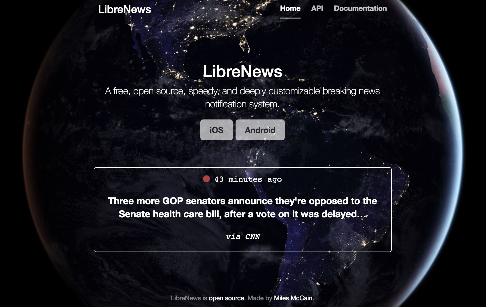
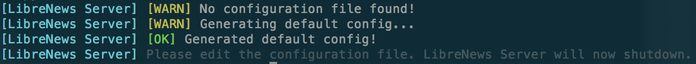

# LibreNews-Server

LibreNews-Server is the server side of the LibreNews ecosystem. It provides a RESTful JSON api by which clients can retrieve the twenty latest breaking news notifications. This implementation uses Twitter's BBC breaking news account to detect breaking news, however it is possible to implement a LibreNews that uses a different source of implementation -- just update the `flashes.py` file as necessary.

This file will provide three documentations: 1) how to use LibreNews-Server from the perspective of a user, 2) how to use LibreNews server from the perspective of a developer who is making a LibreNews client, 3) from someone who wants to run a LibreNews server for herself, and 4) from the perspective of a developer who wants to modify or build a new LibreNews-Server.

## 0\. General Terminology

LibreNews uses a few terms that you may be unfamiliar with in its API and UI.

**Flash**: a _flash_ is a breaking news item (not to be confused with a **notification**, which actually shows up in your phone and is just a representation of a flash).

**Channel**: a _channel_ is a grouping mechanism that allows for end users to better customize their feed. In this implementation, it is the same as a _source_, which is the news organization which released the flash.

(That's the only confusing terminology.)

## 1\. End-user documentation

### 1.1 Screenshots

 _(The web interface of LibreNews)_

 _(LibreNews starting up!)_

### 1.2 Usage Guide

There are few reasons that an end-user would need to interact with the server themselves. The webserver only would provide them a visual interface by which they could see the server's latest notification. Indeed, it provides little utility on its own. **Distributing notifications via a web interface (using websockets and the web notification API) is on the roadmap.**

For detailed instructions on how to use your LibreNews client, please refer to its own documentation.

## 2\. Developer documentation

Want to make your own LibreNews client? You've come to the right place.

Most of the power of the LibreNews server for developers lies behind the `/api` endpoint. This is where you'll want to go to get the data for your app. This endpoint requires no authentication and has no rate limiting, however please be reasonable in the load that your application puts on the server. (You may be kindly asked to run your own notification server if your application is found to put so much load on the server that it negatively affects other users.)

The `/api` endpoint provides a RESTful JSON api. It provides the latest 25 flashes, as well as the server's name and the channels offered by the server. Because one of the goals of LibreNews was to make it as simple as possible, it is not currently possible to specify only certain channels in the GET request.

The response can be filtered with the following HTTP parameters:
* `latest`: specify the lowest possible ID (exclusive) that flashes may have in order to be returned. For example, the following request would only return flashes newer than the flash ID `892106396610768897`: `/api?latest=892106396610768897`

Here is a sample `/api` response:

```{
    "channels": [
        "Announcements",
        "Breaking News"
    ],
    "latest": [
        {
            "channel": "Breaking News",
            "id": 879866339728515073,
            "link": "http://bbc.in/2tiEJYW",
            "source": "BBC",
            "text": "Venezuela's president speaks of a \"terrorist attack\" after a helicopter apparently tries to bomb the Supreme Court",
            "time": "Wed Jun 28 00:57:37 +0000 2017"
        },
        ...
        {
            "channel": "Breaking News",
            "id": 879645310250876928,
            "link": "http://bbc.in/2tg2bq3",
            "source": "BBC",
            "text": "Google \"respectfully\" disagrees with EU's decision & considers appeal against record fine",
            "time": "Tue Jun 27 10:19:19 +0000 2017"
        }
    ],
    "server": "LibreNews Central"
}
```

The `id` of a flash is guaranteed to be unique. It is safe to use this to differentiate between flashes. For this server implementation, the `id` is the Tweet's `id`. It must be a positive **unsigned** `integer` or `large integer` value, and must be chronological (i.e. flashes chronology may be compared by referencing their IDs, as older flashes must have lower IDs than newer ones).

**All LibreNews server implementations must follow this API specification. For more details on this specification, see documentation section 4.1.**

It is best to ping the LibreNews server every two minutes _at most_. Your notification application will need to continually ping the server, but please keep the rate reasonable. Also remember that network requests eat up your users' phone data... so be careful, and remember to make your app customizable!

## 3\. LibreNews Server Operator documentation

Running a LibreNews server can be quite easy, or it can be quite difficult. This server was meant to be as simple to set up as possible in order to encourage the creation of many other LibreNews servers and therefore further decentralize the LibreNews ecosystem.

To start a LibreNews server, first make sure that you have `Python 2` and `pip` installed. LibreNews-Server has the following dependencies, each of which can be installed with `pip install <dependency>`, if necessary:

- `colorama`
- `arrow`
- `python-dateutil`
- `tornado`
- `tweepy`
- `python-geoip`

(These dependencies are also listed in `requirements.txt`, so they can all be installed at once once the repository is cloned to your local machine with `pip install -r requirements.txt`.)

Once you have all of these installed, you can download LibreNews if you haven't already. This is done by navigating into the parent directory where you would like to place the root LibreNews folder and running `git clone https://github.com/milesmcc/LibreNews-Server.git`. A new folder, `LibreNews-Server`, will be created.

Navigate to the directory in which you would like for LibreNews to create its configuration file (`LibreNews-Server/src` is fine) and run `python webserver.py`. Remember that if you're not running LibreNews out of the `src` directory, you'll need to reference `webserver.py` using its absolute or relative path.

LibreNews will then detect that it has not been set up, and will generate a configuration file in the working directory called `config.json`.



The newly generated config will look something like this:

```
{
    "accounts": [
        [
            "@BBCBreaking",
            "BBC",
            "Breaking News"
        ],
        [
            "@LibreNewsApp",
            "LibreNews",
            "Announcements"
        ]
    ],
    "twitter": {
        "access_token": "XXXXX",
        "access_token_secret": "XXXXX",
        "consumer_key": "XXXXX",
        "consumer_secret": "XXXXX"
    }
}
```

Get your credentials from Twitter at <https://apps.twitter.com>. Configure the accounts that you would like LibreNews-Server to monitor. The first field is the account's Twitter handle, the second field is its human readable source name, and the third field is for the channel the account belongs to.

Once you correctly input your Twitter credentials, run `webserver.py` once more (in the exact same way) and watch as the server magically comes online at port `8888`. If you navigate to `http://localhost:8888` in your browser, you should find the beautiful LibreNews home page! This LibreNews server implementation has no database.

For production servers, it's heavily recommended that you use nginx as a reverse proxy. That way, you'll be able to accept standard HTTP and HTTPS requests on ports 80 and 443, respectively. (That is, if you choose to even process HTTP requests -- because the server at <https://librenews.io> _doesn't!_)

> It's important to note that the default [LibreNews Client](https://github.com/milesmcc/LibreNews-Android) does *not* allow server connections over HTTP.

## 4\. LibreNews Server hacker Guide

So you want to hack on the server? Go for it! Whether you want to contribute to this server or make your own, there are a few things you'll need to know.

### 4.1 LibreNews API specification

It's imperative that all LibreNews server implementations provide the same API, so that users can seamlessly transition between them without having to get a new notification app or download any new configurations. Make sure your server implementation--or the changes you make to this one--maintain these guidelines.

#### 4.1.1 Location of API endpoint

The API may not be located at the root of a domain or subdomain. For example, `https://example.com/api/endpoint` _is_ allowed, however `https://api.example.com` is not. It is best to have some sort of human-readable information page at the document root.

#### 4.1.2 API encoding & format

The API must provide a JSON-encoded object as its API response. The response _may not_ be preceded by JavaScript, meaning that it may not begin with `var x = {...`, for example. It should be a raw JSON blob. It must contain the following fields: `channels`, `latest`, and `server`. It may contain more fields, but these are the bare minimum.

##### 4.1.2.1 Channel specification

The `channel` field is a JSON array of strings, corresponding to all of the unique channels referenced in the `latest` section. It is possible for a channel to be listed in the `channels` field, but not in the `latest` feed. This just means that no flashes have recently come out of that channel. The opposite may not be true, however: all channels referenced in `latest` must be also present in the `channels` field.

The default LibreNews server's `channels` field looks like the following (at the time of this writing): `"channels": [ "Breaking News", "Announcements" ]`

##### 4.1.2.2 Latest specification

The `latest` field is a JSON array of JSON objects (flashes). It must be sorted in order of latest to oldest, with the latest flash at index `0`. It should return no more than 50 flashes. The JSON objects representing the flashes must contain the following fields: `channel`, `id`, `link`, `source`, `text`, `time`.

The `channel` field is a string of the flash's channel, and the `id` field is a unique string which represents the flash. No other flash--in the present, past, or future--may share the same `id` as another flash. The `link` field is a string of the URL of the flash. It may be null, but not omitted. `source` is the flash's source, like BBC, New York Times, or MSNBC. `text`, predictably, is the text of the flash. It should not exceed 150 characters. `time` is the time the flash was created, expressed in the form `%a %b %d %H:%M:%S +0000 %Y` (+0000 is constant, because the time should always be given GMT). For example, a date could be `Tue Jun 27 23:51:35 +0000 2017`.

##### 4.1.2.3 Server specification

The `server` field is a JSON string of the LibreNews server's name. It must be human-meaningful.

### 4.2 LibreNews internal structure

The LibreNews Server source is simple and small. It has no database, although you may hack on it to create one. There are three core Python files: `webserver.py` and `flashes.py`.

#### 4.2.1 `webserver.py`

`webserver.py` acts as a manager for all the other functionality, and will start up the entire operation when called from the command line. There is no need to ever edit this file, unless you would like to change the format of the API. But you probably shouldn't. It's fine the way it is.

If you want to change the default homepage, its template file is available at `src/pages/index.html`.

When run, `webserver.py` will import and run `go()` in `flashes.py`, and then start the webserver on port `8888`. **You can change the data source and look of the LibreNews server without ever touching webserver.py.**

#### 4.2.2 `flashes.py`

`flashes.py` acts as the data manager for the LibreNews server. It performs no logic when it is imported, however its `go()` method is called by `webserver.py` when it is time to load data, either from Twitter, a database, or whatever other source you may implement. To get data, `webserver.py` also calls `get_latest_flashes(num)`, where `num` is the number of latest flashes. The array must be sorted from newest to oldest.

All the other methods you may see in `flashes.py` are merely artifacts of this particular implementation's data structure.

#### 4.3 Final Contribution Notes
LibreNews-Server is an open source project, and is licensed under GPLv3. Contribute!

This product includes GeoLite data created by MaxMind, available from
[http://www.maxmind.com](http://www.maxmind.com).
